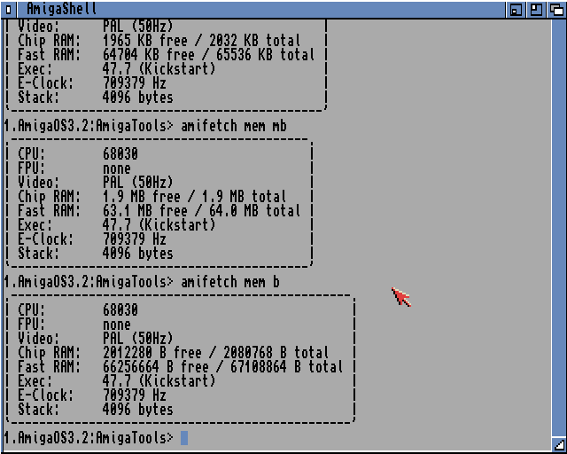

# amifetch

A tiny neofetch-style system info dump for AmigaOS. Run it from a Shell
and it prints CPU, FPU, video timing, chip/fast RAM, Kickstart version,
E-Clock frequency, and current stack size, inside a border box sized to
fit whatever the longest line turns out to be:



## Usage

```
amifetch [MEM unit] [CHIP unit] [FAST unit]
```

`unit` is one of `B`, `KB`, or `MB` (case-insensitive). `MEM` sets the
default for both Chip and Fast RAM; `CHIP`/`FAST` override it
individually. With nothing given, both default to `KB`. `MB` is shown
with one decimal place (`xx.x MB`); `B`/`KB` are whole numbers.

```
amifetch
amifetch MEM=MB
amifetch MEM=MB CHIP=B
amifetch CHIP=B FAST=MB
amifetch CHIP KB FAST B
```

The screenshot above is from a real AmigaOS 3.2 install (FS-UAE,
68030, 2MB chip + 64MB Zorro III fast), showing `amifetch`,
`amifetch MEM=MB`, and `amifetch MEM=B` back to back — the border
resizes correctly in every case, including `B` mode's 8-digit byte
counts, which produce the widest box.

## How it works

Everything comes from `exec.library`'s always-available `execbase`
global and one library call:

- **CPU/FPU** — `execbase.attnflags` is a cumulative bitfield (a
  68030 sets both the `AFF_68020` and `AFF_68030` bits), so this
  checks from the highest bit down and reports the first match.
- **Video timing** — `execbase.vblankfrequency` (50 for PAL, 60 for
  NTSC).
- **Chip/Fast RAM** — `AvailMem(MEMF_CHIP)` / `AvailMem(MEMF_FAST)`
  for free bytes, OR'd with `MEMF_TOTAL` for installed bytes.
- **Kickstart version** — `execbase`'s embedded `lib` node's
  `version`/`revision` fields (this is exec.library's own version,
  which is what "Kickstart version" means in practice).
- **E-Clock** — `execbase.eclockfrequency`, the timing reference used
  by `timer.device`.
- **Stack size** — this process's `pr_StackSize`, reached by casting
  the built-in `thistask` pointer to a `process` struct.

No `Lock()`/`Examine()`/filesystem access at all, so unlike `dupfind`
this one doesn't need real disk access to do its job — just real
exec.library structures, which still means real AmigaOS (or FS-UAE) to
verify against.

### `/` overflowing, and how the unit conversion avoids it

The first working version divided raw byte counts by 1024 with the
plain `/` operator. Chip RAM (a couple million bytes) displayed fine;
Fast RAM (tens of millions of bytes) came back as garbage — e.g.
`66100000/1024` returned `-25824` instead of `64550`. Isolated with a
series of throwaway diagnostic builds (ruled out `AvailMem()`,
`WriteF()` argument count/order, and variable reuse in turn) and
reported upstream, Darren Coles (E-VO's author) confirmed the cause:
`/` compiles straight to the 68000's hardware `DIVU`/`DIVS`
instruction (32-bit dividend, 16-bit divisor, 16-bit quotient) for
speed, and silently returns garbage if the quotient overflows that
16-bit result — which Fast RAM's `/1024` did (64550 doesn't fit a
signed 16-bit result), while Chip RAM's never got big enough to.
E provides `Div()` for the general large-value case, but it's
markedly slower — since every divisor here is a power of two,
`Shr()`/`Shl()` are both correct *and* the faster choice, not just a
workaround. Worth remembering for any future tool here that divides a
value that isn't guaranteed small.

## Building

Compile `amifetch.e` with the E-VO E compiler:

```
evo amifetch.e
```

This produces an AmigaOS loadseg()able executable named `amifetch`.
