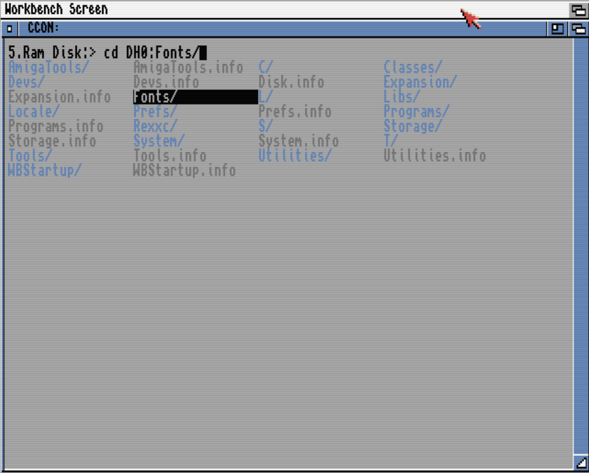
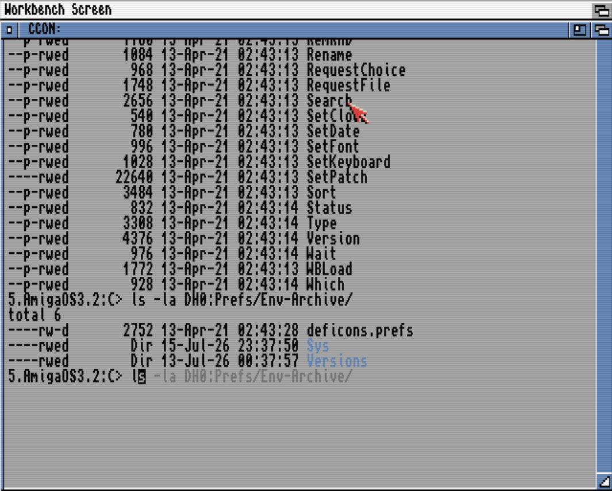
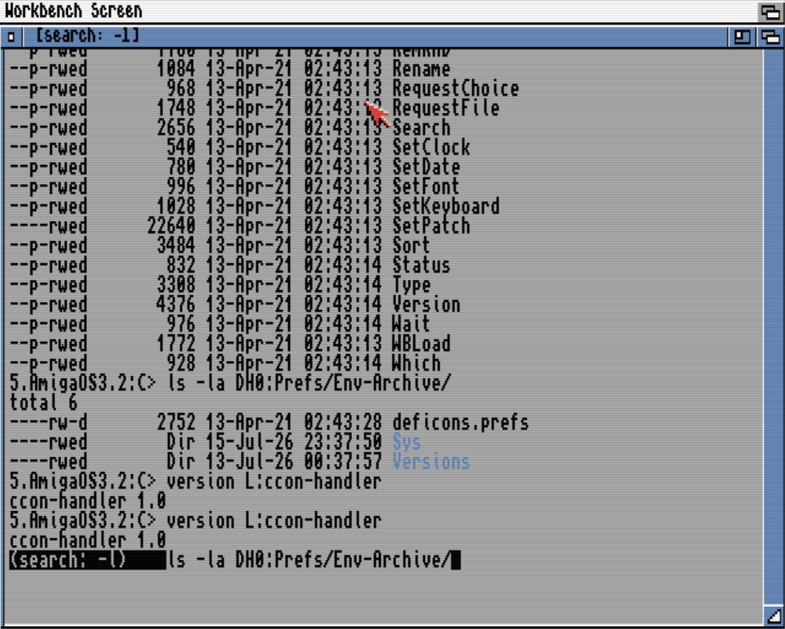

# CCON

An LTX console handler for AmigaOS — the `CON:` family (CON:,
KingCON, ViNCEd) grown at home. A mounted DOS handler speaking the
packet protocol, built around the one feature the stock 3.2 console
cannot be given from outside: **output scrollback** (verified
against the ROM con-handler's option table — no such option
exists, and commands talk to the handler, so no terminal program
can bolt it on). Around that core: a window per open, a modern
line editor, and a shell feel that fingers trained on
fish/bash/zsh recognize at once.

**Status: 1.2.4.** Every milestone boot-verified on AmigaOS 3.2 —
and, as of 1.2.4, on real hardware (A1200 + PiStorm). 1.2.4 is **the
tuning release**: on a real accelerated Amiga it runs the whole
benchmark suite **five times faster than stock `CON:`** and faster on
essentially every test (see **Speed**, below). It builds on 1.2.3's
plane-masked rendering (CCON masks its drawing to the bitplanes the
text actually occupies — the trick read out of the 3.2 ROM's own
console.device) and 1.2.2's model-first engine (at most one scroll
blit per write, accept-then-render buffering), and adds the change
that mattered most on real silicon: **it never scrolls a blank
screen.** Before them: 1.2.1 applied a third read of the source (two
memory-corruption fixes among nine); 1.2 brought **iconify** to a
Workbench icon (RightAmiga+I) and clean full-screen page flips; 1.1
brought per-window FONT and soft styles, an alternate-screen contract
for Ed/More, shared persistent history, safe multi-line paste,
scrollback content search, and the KingCON-style `CON:`/`RAW:`
takeover.

## Speed

Measured, not vibed: the 1.2.2–1.2.4 engine was built across one
benchmarked campaign, and [conbench](../conbench/) — written for it,
now its own tool — keeps the receipts. The honest mode throughout:
**render barriers on** (`SYNC`), which no write-behind buffering can
hide from. (Unbarriered console benchmarks measure how quickly a
console says "done", not how quickly it draws — ViNCEd's unbarriered
total is 0.18 s against a barriered 111 s. CCON's barriered numbers
sit within a few percent of its unbarriered ones: its fast numbers
and its honest numbers are the same numbers.)

**On real hardware** — an A1200 with a PiStorm accelerator, a fast
CPU driving the genuine AGA chipset, 82×53 window, barriers on:

| console | full suite, barriers ON |
|---|---|
| **CCON 1.2.4** | **2.54 s** |
| stock CON: | 12.98 s |

Five times faster overall, and faster on 13 of the 15 individual
tests (one tie; the single nominal loss is stock's own deferral
reading zero on a test that is already near-zero for both). This is
the config people actually run, and it is the number that counts:
earlier releases were measured only in emulation, where the blitter
is faster than real silicon and hid the one cost — scrolling a blank
screen — that 1.2.4 removes. On that real machine, 1.2.3 had narrowly
*lost* the total to stock; 1.2.4 wins it by 5×.

In emulation the picture is the same shape: on a 68030 dev config
the barriered suite is **CCON 4.3 s vs stock 74 s vs ViNCEd 112 s**.
The one-line history: CCON 1.2.1 ran the original nine-test suite in
**288 seconds**; 1.2.4 runs it in about **two and a half**.

The engine is a short stack of ideas, each proven by a Linux-side
harness before it ever booted: render into the scrollback model
first and let the screen catch up with at most one blit per write
(zero for a screenful, a page flip, or a **blank scroll**); mask the
drawing to the bitplanes the text actually occupies so the blitter
skips empty planes; treat the full-screen editing escapes as model
operations that batch like everything else; erase one prompt cell
instead of repainting the row under every write; and release the
writer as soon as its bytes are copied so bursts pool into batched
blits — the bargain every fast console on this platform makes, with
the ordering kept honest (reads, mode switches, keystrokes,
selection, paste, resize, iconify and close all settle pending
output first) and a program waiting for a keystroke flushed at once
so interaction stays immediate — console.device's own tricks, found
by disassembling it, applied with scrollback-aware
rules it never needed.

## Screenshots

Tab completion's cycling menu — directories blue, hidden grey:



One typed letter, and history's continuation waits in grey —
Right takes it all, Ctrl+Right/Tab word by word:



Ctrl+R replaces the prompt with the search banner, bash style —
the real prompt comes back from the scrollback model:



## Highlights

- **Scrollback**: 512 lines per window by default (`LINES=n` up to
  5000), attribute AND style planes included — Shift/Ctrl+arrows
  and the mouse wheel, working over raw-mode programs too, except
  on a client's own alternate screen (More/Ed mid-page — xterm
  manners, nothing to scroll into there).
- **Scrollback content search**: once you're scrolled back, Ctrl+R
  retargets from command history to searching what's ON SCREEN —
  same incremental feel, matches shown inverted and grabbed onto
  your prompt live, n/N to keep stepping through matches.
- **Shared, persistent command history** across every window, not
  lost when one closes.
- **A window per open**, stock CON: semantics, with the full stock
  option set (`AUTO`, `WAIT`, `SCREENname`, `WINDOW0xADDR`,
  `NOBORDER`, …) parsed per open, `WIDTH`/`HEIGHT` of `-1` filling
  whatever's left of the screen from `X`/`Y`; `*`/`CONSOLE:` opens
  attach to the caller's console.
- **Iconify to the Workbench**: RightAmiga+I sends a window to a
  desktop icon and the console keeps running behind it (output pauses,
  then flushes on restore); double-click the icon and the window is
  back exactly as you left it — scrollback, a half-typed line, cursor
  and all. The icon is built into the handler, and it works over a
  fullscreen client like Ed too.
- **FONT and LINES per window**: your own face/size (loaded from
  disk if needed) or scrollback depth; unset FONT follows your
  Font Prefs default instead of a hardcoded topaz 8.
- **fish-style autosuggestions**: history's continuation as grey
  ghost text; Right accepts all, Ctrl+Right/Tab word by word.
- **bash-style Ctrl+R**: incremental history search; the prompt
  becomes an inverse `(search: …)` banner and is restored
  pixel-perfect from the scrollback model afterwards.
- **zsh-style Tab completion** with a cycling menu, on hand-rolled
  filesystem packets (a handler must not call packet-sending
  dos.library functions — the no-DOS rule).
- **readline surgery**: Ctrl+W/U/K, and Ctrl+L clearing the screen
  *into history* — Shift+Up undoes the clear.
- **Copy & paste** both ways with the stock console family
  (IFF FTXT): drag with output frozen mid-drag like stock,
  double-click word, triple-click line. RAMIGA-V pastes safely —
  one ordinary-looking line at a time with a grey "N more queued"
  hint, never blindly running a whole clipboard's worth of
  commands (RAMIGA+SHIFT+V or the PASTEEXEC option for the old
  instant-run way).
- **Two colour worlds kept apart**: `WBPENS` declares a truly-ANSI
  palette; on any other screen plain SGR 3x stays raw pens (what
  WB-pen programs like Ed mean) while bold+3x — ANSI colour intent,
  the `ls` scheme — is translated by colour through ObtainBestPen.
  `ls` is genuinely blue everywhere; Ed is never red — plus real
  italic/underline/inverse soft styles.
- **Fullscreen programs work**: Ed with working menus (picks travel
  the same IECLASS_MENULIST route as on stock CON: — read out of
  Ed's disassembled parser), block cursor, class-12 resize
  re-measure, and proper whole-view scrolling (ANSI Scroll Up/Down
  honoured, not just the one changed row); More with real
  timer.device WAIT_CHARs, and it restores your scrollback
  transcript on exit exactly as xterm's alternate screen does —
  paged content never enters your history.
- **xterm-style window titles** (OSC) that survive scrollback.
- **CRAW:** — the same binary mounted raw-from-byte-one, the
  `RAW:` counterpart.
- **Can replace CON:/RAW: system-wide**, KingCON style — dismount
  the stock devices, mount CCON: under their names instead, and
  every console the OS opens becomes a CCON: window. Experimental;
  see `ccon.doc` section 15.
- Swedish (and other) dead-key composition survives raw mode.

## Try it

```
copy ccon-handler L:
copy CCON-mountlist DEVS:
Mount CCON: FROM DEVS:CCON-mountlist
Mount CRAW: FROM DEVS:CCON-mountlist
NewShell CCON:
```

More in the docs: `ccon.readme` is the quick overview,
**`ccon.doc` is the handbook** — every option, every key, the
design notes. A running handler keeps its seglist: after updating
`L:ccon-handler`, reboot — a re-Mount alone does nothing.

## Files

- `ccon-handler.e` — the source, Amiga E, one file.
- `ccon-handler` — prebuilt AmigaOS binary.
- `CCON-mountlist` — one mountlist, four device stanzas (`CCON:`,
  `CRAW:`, and the experimental `CON:`/`RAW:` takeover pair) for
  `DEVS:`, same shape KingCON's own mountlist uses.
- `ccon.readme` — short-form readme for the release archive.
- `ccon.doc` — the full plain-text manual (Amiga-width lines).
- [`changelog.md`](changelog.md) — the version history, 0.1 to now.
- `ltx-cc12.lha` — the release archive (`L/`, `DEVS/`, docs).
- `todo.md` — the complete build history: every milestone, every
  verified protocol fact, every disassembly finding, every latent
  bug the boots flushed out. The project's lab notebook.

## Building

```
evo ccon-handler.e LARGE
```

`LARGE` became necessary with the M10 console object: member
indirection pushed references past the small model's 32k range.
The generated startup was disassembled against the previous build
to confirm the E handler trick below survives the model change —
it does, byte-identically.

## The E handler trick

An E binary started as a handler has no CLI, so the E runtime's
startup code waits on the process message port and captures the
first message — which is DOS's mount startup packet — into the
`wbmessage` global, believing it a Workbench startup message. The
handler takes the packet from there, replies it itself, and sets
`wbmessage := NIL` so the runtime's exit code (which would reply
the same message again) stays quiet. Verified by disassembling the
generated startup code, not assumed.

## The road there

Ten milestones in three days, each boot-verified before the next
began: proof of life, the transplanted line editor, a real shell,
raw mode, scrollback, completion, colours, the input.device chain
(and the four system freezes it ended), copy & paste, window
resize, the stock option set, a window per open — then the
readline tier on release night. When documentation ran out, the
ROM was disassembled: the V47 shell's undocumented console probe,
console.device's raw event report format, con-handler's window
tag list, and Ed's menu parser were all read out of the bytes.
The whole story, including the lessons paid for in gurus, lives
in `todo.md`.

## Since 1.0

Two themes, same discipline — nothing shipped that wasn't
boot-verified, and every protocol question got settled by reading
the real bytes, not guessed. Theme A: per-window FONT (loaded from
disk through a helper process, the no-DOS rule intact) and real
soft styles, then the alternate screen — More's own V47 binary
turned out to already speak the xterm `?47h`/`?47l` protocol,
found by disassembling it rather than inventing a synthetic
signal. Theme B: shared persistent history, safe multi-line paste
after three design iterations, and scrollback content search,
which took its own six-beta detour through a two-pass keyboard-
dispatch trap before it actually worked.

The last stretch — Ed's scrolling and More's arrow-key paging — is
the clearest case for the house rule: when a client "misbehaves"
under CCON:, compare it against stock CON: before concluding
anything is unfixable. A full `machine68k` disassembly of both
binaries found real, separate bugs each time (Ed was never
receiving the ANSI Scroll Up/Down it actually sends; More's arrow
keys were encoded with the wrong CSI introducer byte) — and a
five-minute side-by-side test against stock CON: is what actually
proved the second one was CCON's bug to fix, after disassembly
alone had twice pointed the wrong way. That same session, CON:/
RAW: replacement went from a parked idea to something running in
a real `S:User-Startup`, once it turned out to need no handler
code at all — just the same mountlist trick KingCON already uses.
The full account, including what didn't work first, is in
`todo.md`.

## Since 1.1

CCON: windows now **iconify** to the Workbench — RightAmiga+I
collapses a window to a desktop icon (its own icon, built into the
handler, so there's nothing to install), the console keeping its
scrollback and half-typed line behind it; a click brings it back
untouched. Getting there settled, the hard way, that a DOS-handler
window can't take a click on a title-bar gadget at all — the standard
iconify gadget is handled entirely inside Intuition with no report to
the app, and a custom gadget renders but never sees the click — so
the trigger is a key, the way AmiExpress does it. And More, or any
program that repaints a full screen, now REPLACES the page on a form
feed the way `CON:` always did, instead of scrolling it — the one
thing 1.0 and 1.1 were missing. And 1.1's raw arrow-key fix turned out
to be half a fix: switching the cursor-key introducer to the 7-bit
`ESC[` made More page but had been silently breaking Ed, which reads
that `ESC` as its command line — both are back on the 8-bit `$9B` stock
`CON:` sends, and both navigate now. Fixing that also un-stuck Ed's
window resize, which had looked unfixable: the earlier attempt's "Ed
breaks worse" was this very arrow bug firing on every test keypress, not
the resize — with it gone, letting the resize event through repaints Ed
and lets it re-measure cleanly. The full account is in `todo.md`.
