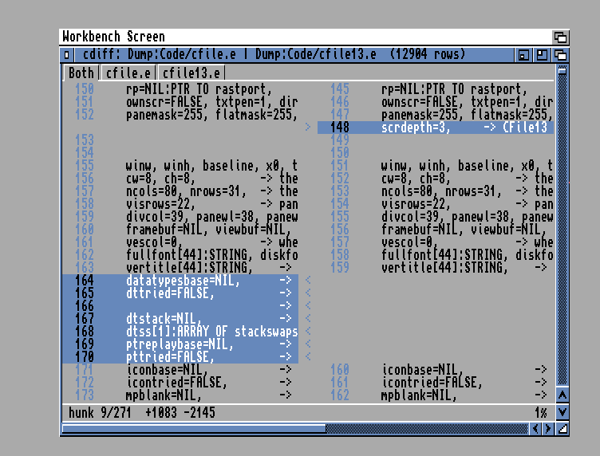

# cdiff — a visual diff for AmigaOS

The tool the platform never got: side-by-side file compare in a
window, with a real diff algorithm underneath. Born 1.8.26 from the
observation that maintaining a fork (cfile vs cfile13) means living
inside a 12,000-line diff with no way to *see* it on the machine.



The first C-language member of the C* family — built with Bebbo's
m68k-amigaos-gcc instead of Amiga E, chosen for the RKM-verbatim API
documentation and the newer optimizer. The testing discipline is
unchanged: the engine is pure logic, proven by a harness that runs
on the host AND under vamos before anything boots.

## Usage

    cdiff FILE1/A,FILE2/A,TEXT/S

GUI (default): a window on the Workbench screen, FILE1 left, FILE2
right, changed rows as blue bar rows with a `< | >` marker column
and receding line numbers in the gutter.

Started from Workbench (no arguments), the window opens empty and
the **Project** menu supplies the files: *Open Files...* asks for
the left then the right file (ASL requester, one by one), *Open
Left/Right...* swaps a single side later, *Quit* leaves. The same
menu works in a CLI-started window.

| key | action |
|---|---|
| cursor up/down | scroll one row (shift = page) |
| space / b | page down / up |
| t / e | top / end |
| n / p | next / previous hunk |
| Amiga+D | differences only — collapse unchanged runs to a marker |
| Amiga+F | find... (Navigation menu) |
| Amiga+N | find next; Find Previous from the menu |
| Esc / Backspace | back to the Tree (never quits) |
| Amiga+Q | quit |

## Tooltypes

Set these on cdiff's Workbench icon (no config file — the icon carries
the settings). All optional; a shell launch ignores them.

| tooltype | effect |
|---|---|
| `FONT=topaz/8` | text font, family name and size (`.font` is appended for you; `topaz.font/8` also works). **Fixed-width only** — a proportional font is refused and the system font used instead, because every measurement here is columns × character width |
| `EDITOR=C:Ed` | beats `ENV:EDITOR` for the Edit menu |
| `DRAWER=Work:Code` | where the file requester first opens |
| `OPENSCREEN=cdiff` | **opens cdiff's own public screen** under that name, cloned from Workbench. Absent = the window opens on Workbench as usual. The screen closes when cdiff quits or iconifies, so it never leaves an empty screen behind |
| `PUBSCREEN=name` | **attaches** to a public screen someone else already opened (the opposite of `OPENSCREEN`). Falls back to Workbench if that screen is not there. `OPENSCREEN` wins if both are set |
| `SCREENDEPTH=2` | bitplanes for that screen (2–8). Only meaningful alongside `OPENSCREEN` — on its own it does nothing. Absent = clone Workbench's depth. cdiff only draws in pens 0–3, so 2 planes is enough, and blit cost is per plane: a 2-plane screen scrolls in half the blits of a 4-plane one |
| `STATUSBAR=YES` | the status row at the bottom (`YES` if unset). **Settings / Status bar** toggles it and writes this tooltype back to the icon, so the choice survives the next launch |
| `CONTEXT=3` | unchanged lines kept either side of a change in **Settings / Differences only** (3 if unset) |
| `FASTSCROLL=NO` | the scroll blit (`NO` if unset — it tears more visibly than a full repaint on some displays). **Settings / Fast scroll** toggles it and writes this back |
| `TABSIZE=4` | tab expansion width (8 if unset) |
| `LEFT/TOP` | window position; default is the top-left of the screen, below the title bar |
| `WIDTH/HEIGHT` | window size, measured **from** `LEFT`/`TOP`. `-1` (or leaving it out) reaches the screen edge without overrunning it |

Two project icons dropped on the cdiff icon are compared as a pair;
one icon becomes the left side.

## Binary files

cdiff compares **text**. Opening a binary — an executable, `.info`,
module, sample, image or archive — is refused with an honest verdict
instead of a meaningless line diff:

```
both files are binary - cdiff compares text
cfile.info  1284 bytes
cfile13.info  1290 bytes
first difference at byte 312
```

A line diff of a binary breaks "lines" at stray `0x0A` bytes and
renders every non-printable as `.`, so two rows that genuinely differ
are flagged as changed while looking identical on screen — the tool
saying "these differ" and then showing nothing. Detection is a NUL
byte in the first 8K, which is reliable for Amiga text. `TEXT` mode
prints the same verdict and exits `5` (WARN).

`TEXT`: unified-style listing to stdout — and the on-target test
road under vamos, where the GUI cannot run.

## Engine

Patience diff (the git-patience shape): lines unique in both files
anchor a longest-increasing-subsequence chain; recursion fills the
gaps; non-unique leftovers become honest replace blocks. O(N) extra
memory, heap-only work arrays, depth-capped recursion — a
shell-default stack survives any input (`__stack = 65536` belt and
braces). Hash collisions are handled conservatively: a collision can
only demote an anchor, never fabricate a false match.

Measured (vamos, emulated 68k): cfile.e vs cfile13.e — 12,210 vs
11,149 lines — in 2.5s: 489 hunks, +1083 −2145.

## Building

    make            # cross-compile with /opt/amiga gcc
    make test       # harness: host cc AND m68k-under-vamos
    make deploy     # copy into the FS-UAE Dump drive

## Status

0.1b1 — first light. See roadmap.md.
