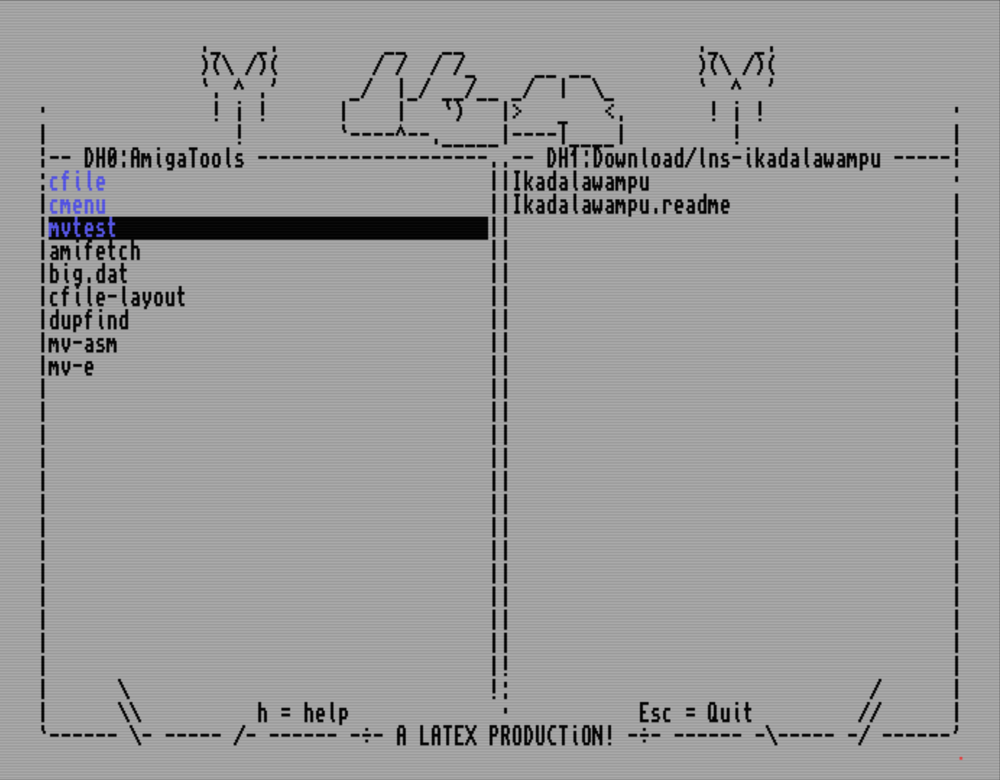

# CFile

A two-pane, keyboard-driven text-mode file manager for AmigaOS.



Two directory panes inside a full-screen character frame. The frame
is not a fixed bitmap: it is composed at startup for whatever font
and screen it finds, so a small custom font gets a wider, taller
grid and the same layout. The selection bar is the only highlight
and lives in the active pane; everything is done from the keyboard.
Files are recognised by their headers (hunk executable, lha/lzx/zip,
ANSI, text), and each verb does the natural thing for the type.

## Keys

| Key | Action |
|-----|--------|
| `Tab` | switch the active pane |
| `Up` / `Down` | move the selection (`Shift` = page, `Ctrl` = first/last) |
| `/` | filter the pane live — type to narrow to matching names, `Up`/`Down` walk the matches, `Space` marks one, `Enter` keeps the cursor on the match, `Esc` restores the full listing |
| `Right` | enter the selected directory, volume, or lha archive |
| `Left` | parent directory; at a device root, the volume list; inside an archive, up a level and then back out |
| `Enter` | open by type: enter a directory or lha archive, view text/ANSI, run an executable (asks first), hex-view the rest |
| `v` | view: text pager, ANSI art with the classic palette, hex dump for binaries, contents listing for archives; with marks, a tour — `Right` = next (unmarks the viewed file), `Left` = back, `Esc` keeps the rest marked |
| `e` | edit a text file in place (`e` inside the viewer works too) |
| `i` | info window: size, date, comment, and the protection bits — `h s p a r w e d` toggle them live |
| `Space` | mark/unmark the entry (and step down) |
| `a` / `A` | mark all / mark none |
| `*` | invert the marks |
| `+` | mark by pattern — a `*.mod` glob or an AmigaDOS `#?.mod` pattern; matches are added to the marked set |
| `=` | measure the selected directory — its size replaces `<DIR>` in the size column and then counts towards the marked total |
| `s` | sort: pick `(n)ame`, `(s)ize` or `(d)ate`, or `(r)everse`; both panes re-sort at once, directories stay first |
| `c` / `C` | copy the selection or marked set to the other pane (`C` overwrites collisions) |
| `m` / `M` | move likewise (same volume is a rename; across volumes copies and deletes) |
| `r` | rename; with marks, one prompt per entry |
| `n` | new: a name ending in `/` makes a directory, any other name opens the editor on a new file (created only when saved) |
| `Del` / `D` | delete the selection or marked set, directories recursively (asks first) |
| `u` | unpack the selected archive — or every marked archive — into the other pane |
| `p` | pack the selection or marked set into an archive in the other pane |
| `:` | run a shell command in the active pane's directory |
| `?` / `Help` / `h` | help screen |
| `Esc` | quit (asks first) |

In every text prompt the cursor walks with `Left`/`Right`, and
`Shift+Left`/`Shift+Right` jump to the start and end of the line.

## File operations

Copy and move ask about name collisions per file —
`(s)kip (o)verwrite (r)ename?` — and all questions are asked *before*
anything is transferred, so cancelling leaves everything untouched.
Directories go recursively; copying preserves protection bits,
datestamps and comments; a directory can be merged into an existing
one. A centered progress bar (byte-accurate for copies) covers the
longer operations.

Deleting is recursive and resilient: a delete-protected entry asks
`unprotect? (y)es (n)o (a)ll`, an entry that will not go is skipped
and the rest of the run continues, and the summary names what
remains. Marks turn `c`/`m`/`Del`/`u` into bulk operations on the
whole set at once; `r` walks the marked set one prompt at a time,
and `v` tours it. `Space` marks one; `a`/`A` mark all/none, `*`
inverts, and `+` marks by pattern (a `*.mod` glob or AmigaDOS
`#?.mod`).

Icons ride along: copy, move, delete or rename a file or drawer and
its `<name>.info` goes with it, so nothing loses its Workbench icon
(marking a file *and* its icon still handles the icon once). `ICONS
OFF` in the config leaves icons where they are.

## The editor

`e` opens a text file in the frame: arrows move the cursor (`Shift` =
page and line ends, `Ctrl` = first/last line), `Enter` splits a line,
`Backspace`/`Del` join across line ends, tabs become spaces on load.
`Esc` asks `(y)es (n)o` about saving only when something changed —
otherwise it just closes. `n` opens the same editor on a new file,
which is created only if it is saved. Lines are capped at 200
characters and files at 8192 lines; bigger files stay view-only.

## Archives

`u` unpacks lha, lzx and zip archives (recognised by their headers,
not their names) into the other pane's directory. `p` packs the
selection or marked set into a new archive there — the filename you
type picks the packer: `.lha`/`.lzh`, `.lzx` or `.zip`. The archiver
runs from the source directory, so archives contain clean relative
paths. `v` on an archive shows its contents listing in the viewer.

## Inside an archive

`Right` or `Enter` on an lha archive goes **inside** it, and the pane
behaves like a directory: the tree is listed a level at a time,
`Right` walks into a folder, `Left` comes back up and finally out to
the real directory the archive sits in. The border row shows where
you are, archive path and all. The archive is listed once on entry
and the panes are filtered from that listing, so moving around
inside costs nothing.

Most verbs work in there:

| Key | Inside an archive |
|-----|-------------------|
| `v` / `Enter` | view a member — text, ANSI or hex, by header |
| `e` | edit a text member in place; written back on save |
| `c` / `C` | copy the selection or marked set out to the other pane, files and folders alike — or, with the other pane inside an archive, copy *into* it |
| `m` / `M` | move likewise, out of or into the archive |
| `r` | rename a member or a folder |
| `n` | a name ending in `/` makes a directory inside the archive; anything else opens the editor on a new member, added when saved |
| `Del` / `D` | delete members and folders (asks first) |

**Edits are held until you leave.** As you delete, add, edit, copy or
move members the pane updates at once, but the archive on disk is left
alone and the border row shows `modified`. Leaving the archive (or
quitting) commits the whole session in one pass; a modified archive
asks first — `(s)ave` writes the changes, `(d)iscard` throws them away,
`(c)ancel` stays inside. The staging lives on the archive's own volume,
not in RAM. `ARCWRITE DIRECT` in the config rewrites the archive on
every edit instead (the old behaviour). Either way the archiver is LhA;
since it can't remove a stored directory, a folder delete rebuilds the
archive to drop it — collapsing any duplicate entries in passing.

`p`, `u` and `:` have no meaning on a member and say so. Only lha is
supported inside for now — lzx and zip still open from outside.

## The console

Commands (`u`, `p`, `:`, and running an executable with `Enter`)
stream their output live into the frame — CFile renders the bytes
itself through a `PIPE:`, no console window, no borders. When the
command finishes, the arrow keys (with `Shift`/`Ctrl`) scroll back
through up to 4000 lines of output; any other key returns to the
panes. `:` commands run with the active pane's directory as their
current directory, and both panes refresh afterwards.

## Configuration

CFile reads `PROGDIR:cfile.config` (plain text, `;` comments):

```
; CFile configuration
LEFT      SYS:
RIGHT     RAM:
SAVEDIRS  ON
ARCWRITE  ONEXIT
ICONS     ON
SORT      name
FONT      MicroKnight7/7
```

- `LEFT` / `RIGHT` — start paths for the panes; the value
  `(volumes)` starts a pane in the volume list. Command-line
  arguments (`cfile [left] [right]`, quotes allowed) override them.
- `SAVEDIRS ON` — on quit, the current pane paths are written back
  as the next start's `LEFT`/`RIGHT`. Only those two lines are
  rewritten; comments and every other line pass through verbatim,
  so hand edits (and edits made from inside CFile) survive.
- `ARCWRITE ONEXIT` — when archive edits reach the disk: `ONEXIT`
  (the default) batches them and commits on leaving the archive,
  `DIRECT` rewrites the archive on every edit.
- `ICONS ON` — the default; copy/move/delete/rename carry a file's
  `<name>.info` icon along. `OFF` leaves icons alone.
- `SORT name` — the start-up sort order: `name` (default), `size` or
  `date`, with an optional `rev` (e.g. `SORT size rev`). The `s` key
  changes it for the session.
- `FONT name/size` — any fixed-width disk font; `topaz` always
  means the ROM font. The whole frame, both panes and the viewer
  re-derive from the font cell, so a small font like a 7×7 gives
  more columns and rows. A font that fails to open, is
  proportional, or leaves less than an 80×18 grid is refused and
  CFile falls back to Topaz/8.

Editing `cfile.config` in CFile's own editor applies it on save:
the font, grid and frames rebuild live, and a bad value keeps the
last good setup. Without a config file the panes start in `SYS:`
and `RAM:`.

CFile also runs without a Startup-Sequence: if `ENV:` or `T:` is
missing at start it creates them the standard way (`RAM:Env`,
`RAM:T`) and removes only what it made, on a clean exit.

## Display

CFile opens its own 8-colour screen (like Workbench, made public as
`CFILE`): grey background, black text, blue directories, black
selection bar that keeps the entry's type colour. Each pane's path
lives in the frame's border row; prompts and messages take that row
over between guillemets and give it back afterwards. Every row shows
a size in its own right-hand column — a file's bytes, `<DIR>` for a
directory until `=` measures it — and the border row shows the
volume's free space, or, while anything is marked, the marked set's
count and total. The volume list shows volumes first, assigns below
them. Viewing ANSI art switches
the palette to the classic ANSI colours and restores it on exit. If
the screen cannot be opened, CFile falls back to a borderless window
on the public screen without its own palette.

## Files

- `cfile` — prebuilt AmigaOS binary (68000, AmigaOS 2.0+)
- `cfile.e` — the source, Amiga E
- `layout` — the frame mockup (ISO-8859-1); its border row shows the
  occupied style, the resting border lives in the embedded frame
- `console-and-view-layout` — the console/view frame mockup

## Building

A prebuilt binary is committed. To build it yourself, compile
`cfile.e` with the E-VO E compiler:

```
evo cfile.e
```

## Verified behaviour

Exercised on an AmigaOS 3.2 install (FS-UAE): pane navigation with
paging, the volume list with assigns, copy and move with collision
prompts and bulk marks, recursive deletes including delete-protected
entries and the unprotect prompts, sequential rename, the info
window with live protection-bit editing, text/ANSI/hex viewing (with
the palette restored on exit), the bulk view tour, the editor
including new files from `n`, archive unpacking singly and in bulk,
`:` commands, running executables, the live console with scrollback,
and the config file end to end — custom fonts (a 7×7 and an 8-pixel
MicroKnight, plus Topaz/8), live reload from an in-CFile edit, and
`SAVEDIRS` preserving hand edits. The size column, `=` directory
measuring, and the border row's free-space and marked totals were
confirmed on the same install. The pack verb, the prompt-line
`Shift` jumps and the `ENV:`/`T:` bootstrap have had the least
testing.

Going inside lha archives was exercised the same way: browsing a
nested archive, viewing members, editing one in place, copying and
moving files and whole folders both out and in and across
subdirectories, renaming, deleting, and making new files and empty
directories — all confirmed against LhA 2.15 on the same install. The
deferred write model was exercised too: batched commits on leave, the
save/discard/cancel prompt, and folder deletes rebuilding the archive
to drop stored directories (and clear duplicates). One known limit:
FS-UAE directory drives can hold host filenames the Amiga side cannot
see; CFile reports these as "invisible entries remain" when they block
a delete.
