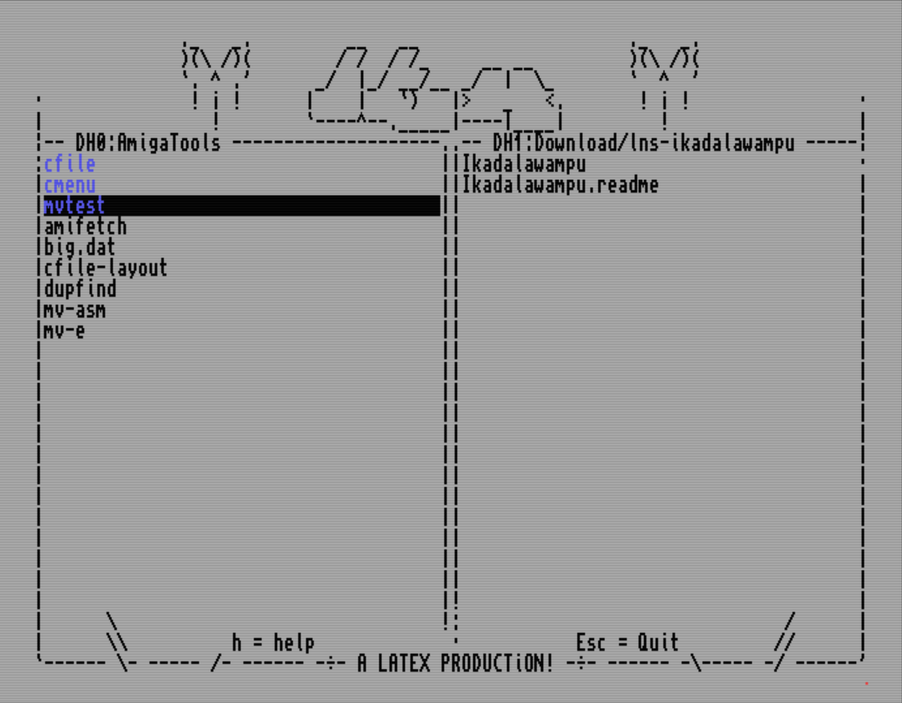
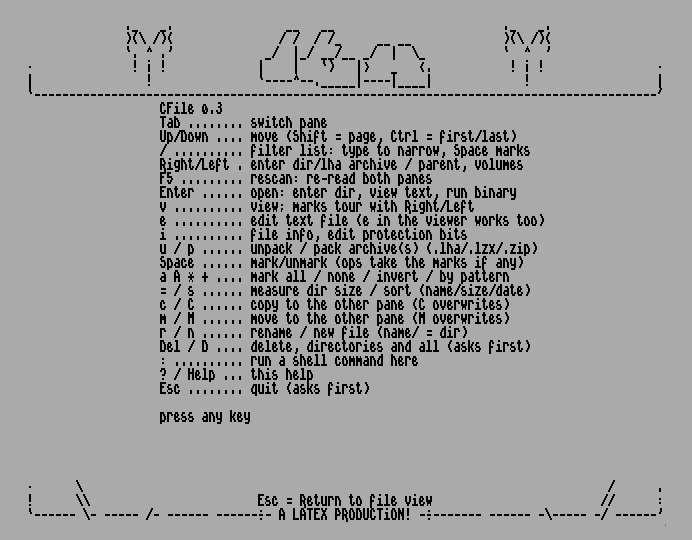
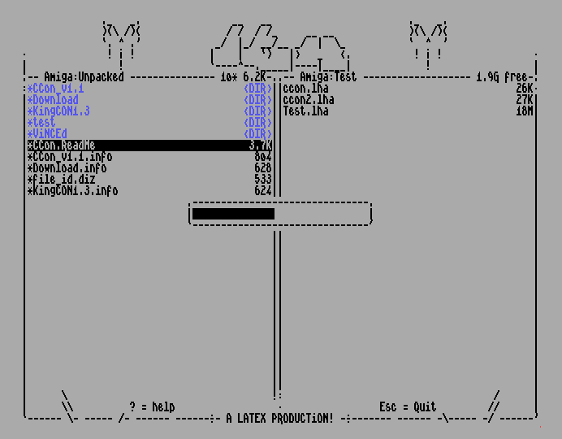
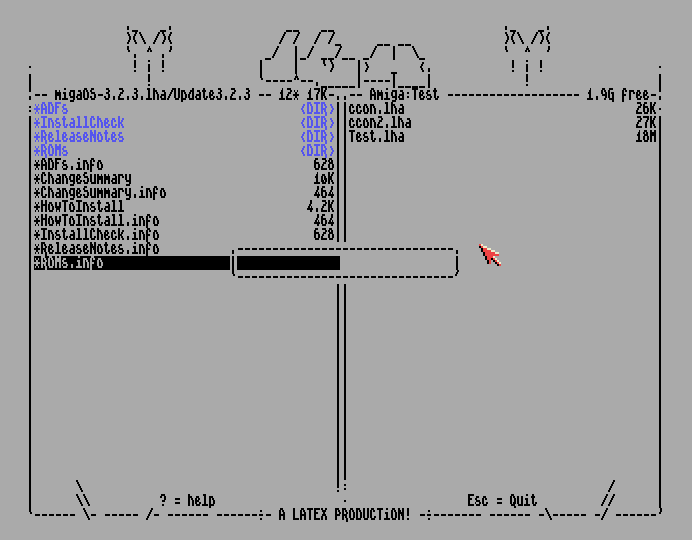
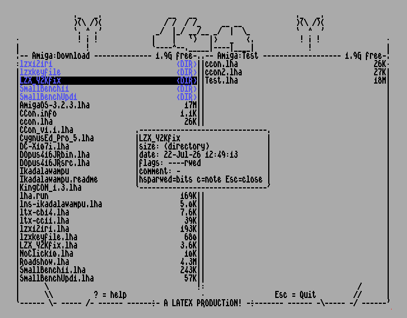

# CFile

A two-pane, keyboard-driven text-mode file manager for AmigaOS.



Two directory panes inside a full-screen character frame. The frame
is not a fixed bitmap: it is composed at startup for whatever font
and screen it finds, so a small custom font gets a wider, taller
grid and the same layout. The selection bar is the only highlight
and lives in the active pane; everything is done from the keyboard.
Files are recognised by their headers (hunk executable, lha/lzx/zip,
ANSI, text, ISO and ADF disk images, ProTracker modules — and, through
datatypes, every picture and sound format your system knows), and each
verb does the natural thing for the type.

## Keys

| Key | Action |
|-----|--------|
| `Tab` | switch the active pane |
| `Up` / `Down` | move the selection (`Shift` = page, `Ctrl` = first/last) |
| `/` | filter the pane live — type to narrow to matching names, `Up`/`Down` walk the matches, `Space` marks one, `Enter` keeps the cursor on the match, `Esc` restores the full listing |
| `g` | go to a typed path — the active pane jumps straight there |
| `b` + `0`-`9` | bookmark this location in a slot; a bare digit jumps back to it. Session-only unless `SAVEBOOKMARKS ON` keeps them across runs |
| `f` | find files by name, recursively from here — a plain substring or a `#?`/`*` pattern; the matches list is selectable and `Enter` jumps to one |
| `t` | text search — grep every text file under here for a substring; the matching lines list as `path:line: text` and `Enter` opens the file |
| `Right` | enter the selected directory, volume, lha/lzx archive or ISO image — or mount an ADF image and go inside |
| `Left` | parent directory; at a device root, the volume list; inside an archive or image, up a level and then back out; at a mounted ADF's root, offers to unmount it |
| `F5` | rescan — re-read both panes from disk. Panes also refresh **by themselves** when the filesystem supports notification (real FFS does; some emulated directory drives do not) |
| `Enter` | open by type: enter a directory, lha/lzx archive or ISO image, mount an ADF, view text/ANSI, show a picture, play a sound or mod, run an executable (asks first), hex-view the rest |
| `v` | view: text pager, ANSI art with the classic palette, hex dump for binaries, contents listing for archives; pictures full-screen (`+`/`-` zoom, `Ctrl`+arrows pan); sounds and ProTracker mods play (any key stops); with marks, a tour — `Right`/`Down` = next (unmarks the viewed file), `Left`/`Up` = back, `Esc` keeps the rest marked |
| `e` | edit a text file in place (`e` inside the viewer works too) |
| `i` | info window: size, date, comment, and the protection bits — `h s p a r w e d` toggle them live, `c` edits the comment |
| `Space` | mark/unmark the entry (and step down) |
| `a` / `A` | mark all / mark none |
| `*` | invert the marks |
| `+` | mark by pattern — a `*.mod` glob or an AmigaDOS `#?.mod` pattern; matches are added to the marked set |
| `=` | measure the selected directory — its size replaces `<DIR>` in the size column and then counts towards the marked total. Inside an archive it sums the member sizes under the folder (instant) |
| `s` | sort: pick `(n)ame`, `(s)ize` or `(d)ate`, or `(r)everse`; both panes re-sort at once, directories stay first. Sorting by date shows a compact date in the size column |
| `c` / `C` | copy the selection or marked set to the other pane (`C` overwrites collisions) |
| `m` / `M` | move likewise (same volume is a rename; across volumes copies and deletes) |
| `r` | rename; with marks, one prompt per entry |
| `n` | new: a name ending in `/` makes a directory, a name ending in `.adf` makes a blank Amiga disk image (formatted FFS, ready to mount), any other name opens the editor on a new file (created only when saved) |
| `Del` / `D` | delete the selection or marked set, directories recursively (asks first) |
| `u` | unpack the selected archive — or every marked archive — into the other pane |
| `p` | pack the selection or marked set into an archive in the other pane |
| `:` | run a shell command in the active pane's directory |
| `?` / `Help` | help screen (scrolls with `Up`/`Down` if it is taller than the window) |
| `Esc` | cancel a running copy/move/delete or archive transfer, otherwise quit (asks first) |

In every text prompt the cursor walks with `Left`/`Right`,
`Shift+Left`/`Shift+Right` jump to the start and end of the line, and
`Shift+Backspace`/`Ctrl+Backspace` delete to the start / back to the
nearest `/` or `:`.



## Getting around

Besides `Right`/`Left` and the volume list, **`g`** takes a typed path
and jumps the active pane straight to it. Ten **bookmark** slots remember
places you keep returning to — `b` then a digit sets one to the current
location, a bare digit jumps back, and `SAVEBOOKMARKS ON` in the config
keeps them across runs. A spot inside an archive or a disk image cannot
be bookmarked.

**`f`** searches by name recursively from here — a plain fragment matches
as a substring, a `#?`/`*` pattern matches the whole name. **`t`** searches
*inside* files, grepping every text file under here for a substring. Both
present their hits in a selectable list: `Enter` jumps to a found file (`t`
opens it), `Esc` backs out, and `Esc` during a long search stops it and
shows what turned up. Either search stops once it has collected 500 hits.

## File operations

Copy, move and delete can be **cancelled mid-run with `Esc`** — it leaves
what's already done (no half-undo) and reports how far it got.

Copy and move ask about name collisions per file —
`(s)kip (o)verwrite (r)ename?` — and all questions are asked *before*
anything is transferred, so cancelling leaves everything untouched.
If the copy won't fit on the target volume, CFile asks before it
starts (a same-volume move is a rename and needs no room).
Directories go recursively; copying preserves protection bits,
datestamps and comments; a directory can be merged into an existing
one. A centered progress bar covers the longer operations and moves
**byte by byte** — not in chunks, not per file: plain copies and
moves count real bytes as they flow, and extracting from an archive
watches the destination files grow on disk, so the bar creeps
smoothly even while lha or lzx does the work. Packing *into* an
archive still advances per member (the compressed size is unknowable
in advance). `Esc` cancels an archive transfer too — the archiver is
told to stop, nothing partial lands, and a cancelled move never
loses its source.



Deleting is recursive and resilient: a delete-protected entry asks
`unprotect? (y)es (n)o (a)ll`, an entry that will not go is skipped
and the rest of the run continues, and the summary names what
remains. Marks turn `c`/`m`/`Del`/`u` into bulk operations on the
whole set at once; `r` walks the marked set one prompt at a time,
and `v` tours it. `Space` marks one; `a`/`A` mark all/none, `*`
inverts, and `+` marks by pattern (a `*.mod` glob or AmigaDOS
`#?.mod`).

Icons ride along: copy, move, delete or rename a file or drawer and
its `<name>.info` goes with it, so nothing loses its Workbench icon
(marking a file *and* its icon still handles the icon once). `ICONS
OFF` in the config leaves icons where they are.

## The editor

`e` opens a text file in the frame: arrows move the cursor (`Shift` =
page and line ends, `Ctrl` = first/last line), `Enter` splits a line,
`Backspace`/`Del` join across line ends, tabs become spaces on load.
`Esc` asks `(y)es (n)o` about saving only when something changed —
otherwise it just closes. `n` opens the same editor on a new file,
which is created only if it is saved. A line grows as long as you
type it and the file grows as many lines as it needs — the only
limit is real memory, and running out says so instead of inventing
a number. The viewer streams: text and hex read through a sliding
window, so a multi-megabyte log or a 30MB binary opens instantly
and `Ctrl` still jumps straight to either end (ANSI art keeps its
whole-file load — escape state must replay from the first byte).

## Archives

`u` unpacks lha, lzx and zip archives (recognised by their headers,
not their names) into the other pane's directory. `p` packs the
selection or marked set into a new archive there — the filename you
type picks the packer: `.lha`/`.lzh`, `.lzx` or `.zip`. The archiver
runs from the source directory, so archives contain clean relative
paths. `v` on an archive shows its contents listing in the viewer.

## Inside an archive

`Right` or `Enter` on an lha or lzx archive goes **inside** it, and the
pane behaves like a directory: the tree is listed a level at a time,
`Right` walks into a folder, `Left` comes back up and finally out to
the real directory the archive sits in. The border row shows where
you are, archive path and all. The archive is listed once on entry
and the panes are filtered from that listing, so moving around
inside costs nothing.



Most verbs work in there:

| Key | Inside an archive |
|-----|-------------------|
| `v` / `Enter` | view a member — text, ANSI or hex, by header |
| `e` | edit a text member in place; written back on save |
| `c` / `C` | copy the selection or marked set out to the other pane, files and folders alike — or, with the other pane inside an archive, copy *into* it |
| `m` / `M` | move likewise, out of or into the archive |
| `r` | rename a member or a folder |
| `n` | a name ending in `/` makes a directory inside the archive; anything else opens the editor on a new member, added when saved |
| `Del` / `D` | delete members and folders (asks first) |

**Edits are held until you leave.** As you delete, add, edit, copy or
move members the pane updates at once, but the archive on disk is left
alone and the border row shows `modified`. Leaving the archive (or
quitting) commits the whole session in one pass; a modified archive
asks first — `(s)ave` writes the changes, `(d)iscard` throws them away,
`(c)ancel` stays inside. The staging lives on the archive's own volume,
not in RAM. `ARCWRITE DIRECT` in the config rewrites the archive on
every edit instead (the old behaviour). LhA can't remove a stored
directory, so a folder delete rebuilds the archive to drop it —
collapsing any duplicate entries in passing; LZX removes directory
members directly and needs no rebuild.

`p`, `u` and `:` have no meaning on a member and say so. lha and lzx both
go inside; zip still opens from outside.

## Disk images

`.iso` and `.adf` disk images are first-class citizens, each handled
the way its nature demands.

**ISO images browse like archives, read-only.** `Right` or `Enter` on
a `.iso` goes inside: CFile reads the ISO 9660 structures itself — no
mounting, no CD filesystem, no dependencies — and the pane walks the
disc a directory at a time. `v` views files straight off the image,
`c` copies files and whole folders out with the byte-smooth bar
(`Esc` cancels mid-file), `=` measures a folder, and the write verbs
refuse politely: it is a CD image, it is read-only. Plain ISO 9660
names are supported; a CD too big for a directory pane (500 entries)
lists its first 500.

**ADF images really mount.** `Right` or `Enter` on an `.adf` mounts
it write-enabled through AmigaOS 3.2's `trackfile.device` (via
`C:DAControl`) and jumps the pane inside — from there it is a real
volume: every verb works, both panes can use it, and writes land in
the image file itself. `Left` at the volume's root asks
`unmount the disk image? (y)es (n)o` — keep it mounted and it stays
until you quit; CFile always unmounts what it mounted on exit, and
never remembers a mounted path as a start directory. Deleting a
mounted image unmounts it first, automatically. An image that is not
a DOS disk (a game/NDOS dump) is refused before mounting instead of
requester-storming. ADF mounting needs AmigaOS 3.2 for DAControl —
everything else in CFile, ISO browsing included, works without it.

**`n` creates transfer disks.** A new name ending in `.adf` makes a
blank 880K disk image — formatted FFS, volume named after the file's
stem, finished and let go of, like anything else `n` makes. `Enter`
mounts it, fill it, unmount it, and carry it to any emulator. A
`.dms` opens the other way: `Enter` unpacks it to a sibling `.adf`
(byte-smooth bar, `Esc` cancels) and mounts DOS disks straight away —
an NDOS game rip keeps the `.adf` with an honest message, which is
the useful outcome anyway.

## Pictures, sounds and music

`v` (or `Enter`) on a picture shows it **full-screen** — decoded
through the system's datatypes, so every format your machine has a
class for works: IFF ILBM out of the box, GIF/JPEG/PNG/BMP on
AmigaOS 3.2, and anything more the user has installed (the WarpDT
pack reaches PCX, PSD, TIFF and WebP). The picture gets its own
screen in its own mode with its own palette; `+`/`-` zoom from ¼× to
4×, `Ctrl`+arrows walk around when zoomed, any other key returns.
JPEGs are decoded reduced and pre-scaled to the screen (via a local
override that never touches your WarpDT preferences), so even a
camera photo fits both the display and chip RAM. Marked pictures
join the `v` tour like any other file — `Right`/`Down` and
`Left`/`Up` page through, mixing freely with text and hex files.

`v` on a sound plays it — 8SVX, AIFF, WAV, whatever your sound
datatypes speak — at the file's own sample rate (rates above Paula's
~28kHz ceiling play as fast as the chip allows). `v` on a ProTracker
module plays it through `ptreplay.library` — both `song.mod` and the
Amiga-style `mod.song` names are recognised by the real magic in the
file, and any key stops the music.

Pictures and sounds need `datatypes.library` v39+ (OS 3.0);
mods need `ptreplay.library` (Aminet, `mus/misc`). Without them
those verbs say so and everything else works.

## The console

Commands (`u`, `p`, `:`, and running an executable with `Enter`)
stream their output live into the frame — CFile renders the bytes
itself through a `PIPE:`, no console window, no borders. When the
command finishes, the arrow keys (with `Shift`/`Ctrl`) scroll back
through up to 4000 lines of output; any other key returns to the
panes. `:` commands run with the active pane's directory as their
current directory, and both panes refresh afterwards.

## Configuration

CFile reads `PROGDIR:cfile.config` (plain text, `;` comments):

```
; CFile configuration
LEFT      SYS:
RIGHT     RAM:
SAVEDIRS  ON
ARCWRITE  ONEXIT
ICONS     ON
SORT      name
FONT      MicroKnight7/7
SAVEBOOKMARKS OFF
```

- `LEFT` / `RIGHT` — start paths for the panes; the value
  `(volumes)` starts a pane in the volume list. Command-line
  arguments (`cfile [left] [right]`, quotes allowed) override them.
- `SAVEDIRS ON` — on quit, the current pane paths are written back
  as the next start's `LEFT`/`RIGHT`. Only those two lines are
  rewritten; comments and every other line pass through verbatim,
  so hand edits (and edits made from inside CFile) survive.
- `ARCWRITE ONEXIT` — when archive edits reach the disk: `ONEXIT`
  (the default) batches them and commits on leaving the archive,
  `DIRECT` rewrites the archive on every edit.
- `ICONS ON` — the default; copy/move/delete/rename carry a file's
  `<name>.info` icon along. `OFF` leaves icons alone.
- `SORT name` — the start-up sort order: `name` (default), `size` or
  `date`, with an optional `rev` (e.g. `SORT size rev`). The `s` key
  changes it for the session.
- `FONT name/size` — any fixed-width disk font; `topaz` always
  means the ROM font. The whole frame, both panes and the viewer
  re-derive from the font cell, so a small font like a 7×7 gives
  more columns and rows. A font that fails to open, is
  proportional, or leaves less than an 80×18 grid is refused and
  CFile falls back to Topaz/8.
- `SAVEBOOKMARKS ON` — keep the ten `b`+digit bookmark slots across
  runs. On quit CFile writes them back as `BOOKMARK0`..`BOOKMARK9`
  lines, replacing the old set. `OFF` (the default) makes the slots
  session-only.

Editing `cfile.config` in CFile's own editor applies it on save:
the font, grid and frames rebuild live, and a bad value keeps the
last good setup.

The config looks after itself: on start CFile writes a fresh
`cfile.config` — every setting with a `;` comment above it — if none
exists, and appends any setting a newer CFile adds that the file
doesn't have yet. Your own lines, values and comments are never
touched, so a new setting just appears; you never add it by hand.

CFile also runs without a Startup-Sequence: if `ENV:` or `T:` is
missing at start it creates them the standard way (`RAM:Env`,
`RAM:T`) and removes only what it made, on a clean exit.

## Display

CFile opens its own 8-colour screen (like Workbench, made public as
`CFILE`): grey background, black text, blue directories, black
selection bar that keeps the entry's type colour. Each pane's path
lives in the frame's border row; prompts and messages take that row
over between guillemets and give it back afterwards. Every row shows
a size in its own right-hand column — a file's bytes, `<DIR>` for a
directory until `=` measures it, or a compact date when sorted by
date — and the border row shows the
volume's free space, or, while anything is marked, the marked set's
count and total. The volume list shows volumes first, assigns below
them. Viewing ANSI art switches
the palette to the classic ANSI colours and restores it on exit. If
the screen cannot be opened, CFile falls back to a borderless window
on the public screen without its own palette.



## Files

- `cfile` — prebuilt AmigaOS binary (68000, AmigaOS 2.0+)
- `cfile.e` — the source, Amiga E
- `layout` — the frame mockup (ISO-8859-1); its border row shows the
  occupied style, the resting border lives in the embedded frame
- `console-and-view-layout` — the console/view frame mockup

## Building

A prebuilt binary is committed. To build it yourself, compile
`cfile.e` with the E-VO E compiler:

```
evo cfile.e
```

## Verified behaviour

Exercised on an AmigaOS 3.2 install (FS-UAE): pane navigation with
paging, the volume list with assigns, copy and move with collision
prompts and bulk marks, recursive deletes including delete-protected
entries and the unprotect prompts, sequential rename, the info
window with live protection-bit editing, text/ANSI/hex viewing (with
the palette restored on exit), the bulk view tour, the editor
including new files from `n`, archive unpacking singly and in bulk,
`:` commands, running executables, the live console with scrollback,
and the config file end to end — custom fonts (a 7×7 and an 8-pixel
MicroKnight, plus Topaz/8), live reload from an in-CFile edit, and
`SAVEDIRS` preserving hand edits. The size column, `=` directory
measuring, and the border row's free-space and marked totals were
confirmed on the same install. The pack verb, the prompt-line
`Shift` jumps and the `ENV:`/`T:` bootstrap have had the least
testing.

Going inside lha archives was exercised the same way: browsing a
nested archive, viewing members, editing one in place, copying and
moving files and whole folders both out and in and across
subdirectories, renaming, deleting, and making new files and empty
directories — all confirmed against LhA 2.15 on the same install. The
deferred write model was exercised too: batched commits on leave, the
save/discard/cancel prompt, and folder deletes rebuilding the archive
to drop stored directories (and clear duplicates). The same verbs were
run inside lzx archives against LZX 1.21 — LZX removes stored directory
members directly, so its folder deletes need no rebuild. One known limit:
FS-UAE directory drives can hold host filenames the Amiga side cannot
see; CFile reports these as "invisible entries remain" when they block
a delete.

The navigation and search verbs were exercised on the same install:
`g` jumping to a typed path, bookmarks set and jumped to and kept
across runs with `SAVEBOOKMARKS ON`, `f` finding by substring and by
`#?` pattern, `t` grepping text files, jumping to a hit from either
list, and `Esc` stopping a long copy, a delete and a running search.

Pictures, sounds and music were exercised on the same install
(3.2's stock datatypes plus a registered WarpDT pack): ILBM, PNG,
WebP and a 1440×1440 camera JPEG viewed full-screen with zoom and
panning; a WAV played at the right tempo; ProTracker modules played
and stopped from both naming styles. The datatype road was proven by
six standalone probe rounds (kept in `tests/`) before it ever
entered CFile.

Disk images were exercised the same way: browsing, viewing and
copying out of ISO images (including a 120-file directory and a tree
eight levels deep — the parser was proven against independently
verified test images before it ever ran on the Amiga), mounting
ADFs, writing into them, creating blank images with `n`, deleting a
mounted image (auto-unmount first), unmounting from the volume root,
and quitting with images still mounted. `Esc` cancelling a running
archive extraction — the archiver told to stop, no partial files
left — was exercised on the same install.
